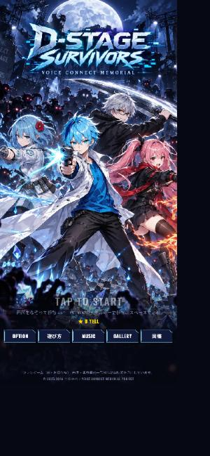
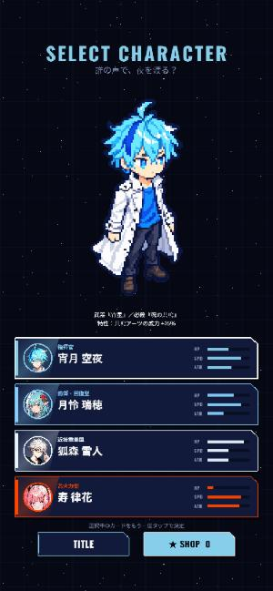
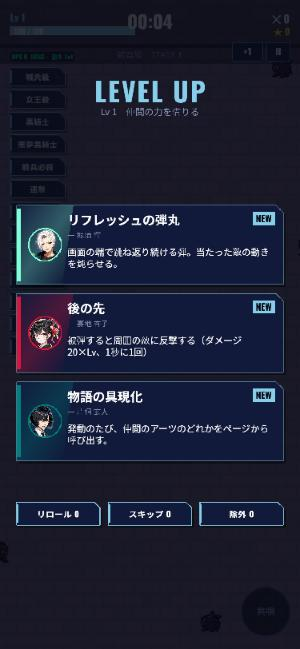
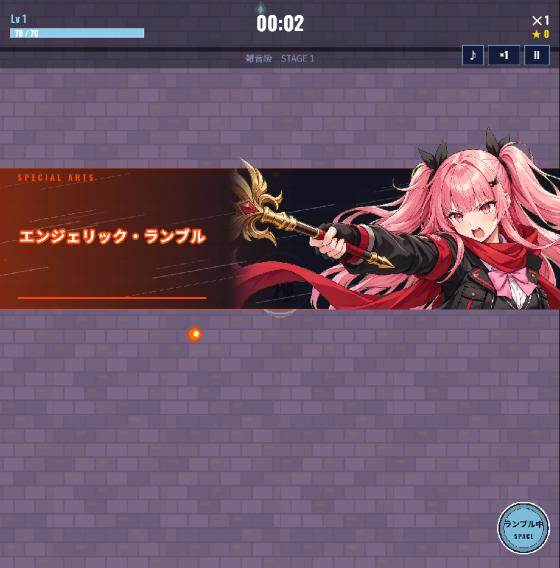
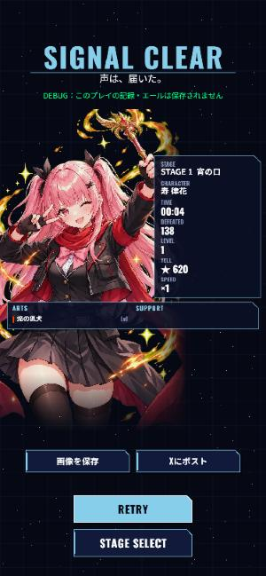
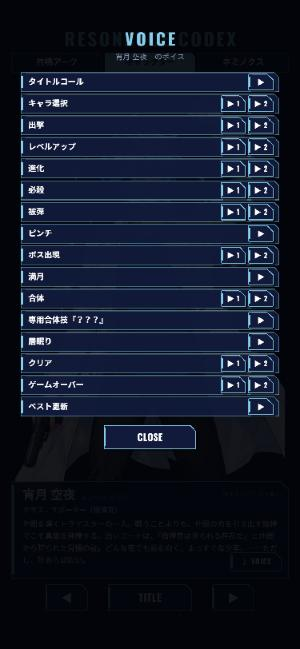

# D-STAGE SURVIVORS

**▶ Play: https://kuyavoice.github.io/vcm-game/** （スマホ・PC のブラウザで無料、インストール不要）

『ボイスコネクトメモリアル』（言峰空也・カクヨム連載中）のファンゲーム（IF・お祭り枠）。
移動だけで遊べる生存アクション。攻撃はすべて自動、仲間の『共鳴アーツ』を借りて影の群れを退けろ。

A fan game of *Voice Connect Memorial*. A survivors-style action game you can play with movement alone: attacks are automatic, and you borrow your friends' "Resonance Arts" to push back the shadows. Free in your browser, nothing to install.

| | | |
|---|---|---|
|  |  |  |
|  |  |  |

## 遊び方 / How to play

- 画面をなぞって移動（PC は WASD／矢印キー）。攻撃は自動。
- 倒した敵が落とす「声の欠片」でレベルアップし、仲間の共鳴アーツやサポートを選ぶ。
- 敵を倒すとゲージが溜まり、満タンで必殺（右下のボタン／PC はスペース）。
- アーツを Lv8 まで育て、対応するサポートを持って宝石箱を開けると進化。決まった2つを揃えると合体。
- 5人の操作キャラ、3つのステージ＋スコアアタック＋EX「悪夢」、エンドレス、ボスラッシュ。図鑑・実績・ギャラリー・ミュージック・ボイス鑑賞。
- オプションの LANGUAGE で主要な画面を英語にできます。

Drag to move (PC: WASD / arrow keys). Attacks are automatic. Collect Voice Shards to level up and pick Resonance Arts and Supports. Fill the gauge to unleash a Special. Raise an Art to Lv8 with its matching Support and open a Jewel Box to evolve it; pair two specific Arts to fuse them. Five playable characters, three stages plus Score Attack and the EX stage "Nightmare", Endless and Boss Rush modes, a codex, achievements, a gallery, a music player and a voice gallery. OPTION → LANGUAGE switches the main screens to English.

審査・試遊用：**https://kuyavoice.github.io/vcm-game/?judge** で全ステージ・全キャラを解放した状態で遊べます（記録は保存されません）。
For reviewers: **https://kuyavoice.github.io/vcm-game/?judge** opens every stage and character (nothing is saved).

## 技術 / Tech

- Vite 7 + TypeScript + Phaser 3.90。縦画面 720×1280 を基準に `Scale.EXPAND`、PC の横長画面にも対応。
- データ駆動：キャラ・アーツ・敵・ステージ・曲・ボイス・実績は `src/data/*` の配列を足すだけで増える。
- 静的ビルド。GitHub Pages（`gh-pages` ブランチ）で配信。ホーム画面に追加するとフルスクリーンで起動（Web App Manifest）。

## AI の利用について / Use of AI

このゲームは個人制作で、制作の一部に AI を使っています。ゲーム内の CREDITS にも同じ内容を記載しています。

- **プログラム**：言峰空也が設計・仕様を書き、Claude（Anthropic）と共同で実装。
- **ボイス**：言峰空也／雪狐／瑞浪蓮／雛桜律。一部のボイスは ElevenLabs による音声生成。
- **音楽**：全曲、言峰空也が Suno（有料プラン）で制作。権利は言峰空也に帰属。
- **イラスト・ドット絵**：一部の画像の制作に画像生成 AI を活用。

This is a solo project that used AI tools for part of the production (the same information is shown in the in-game CREDITS):

- **Programming**: designed and specified by Kotomine Kuya, implemented together with Claude (Anthropic).
- **Voices**: Kotomine Kuya / Yukikitsune / Mizunami Ren / Hinasakura Ritsu. Some voices were generated with ElevenLabs.
- **Music**: all tracks made by Kotomine Kuya with Suno (paid plan). Rights belong to Kotomine Kuya.
- **Illustrations / pixel art**: some images were made with image-generation AI.

## 開発 / Development

```bash
npm install
npm run dev      # http://localhost:5180（--host 付き。同じ Wi-Fi のスマホから LAN の IP で実機確認可）
npm run build    # 型チェック + dist/ へ静的ビルド
npm run preview  # ビルド結果の確認
npm run deploy   # build → dist/ を gh-pages ブランチへ push → https://kuyavoice.github.io/vcm-game/
```

```
src/
  main.ts            Phaser の起動設定
  scenes/            Boot / Title / CharaSelect / StageSelect / RushSetup / Game / LevelUp / Chest / Pause / Result / Shop / Codex / Gallery / Music / Option / HowTo / Credits
  data/              キャラ・武器（アーツ）・パッシブ・敵・ステージ・ウェーブ・曲・ボイス・図鑑・実績の定義
  systems/           スポナー・経験値・強化・アーツ・必殺の処理
  entities/          プレイヤー・敵
  ui/                HUD・ボタン・パネル・カットイン・案内
  utils/             音・保存・解放・共有画像・言語
public/assets/       画像・音（ビルドにそのまま含まれる）
```

## クレジット / Credits

原作：『ボイスコネクトメモリアル』 言峰空也　https://kakuyomu.jp/works/2912051602671195569

© 2025-2026 言峰空也 / VOICE CONNECT MEMORIAL PROJECT
